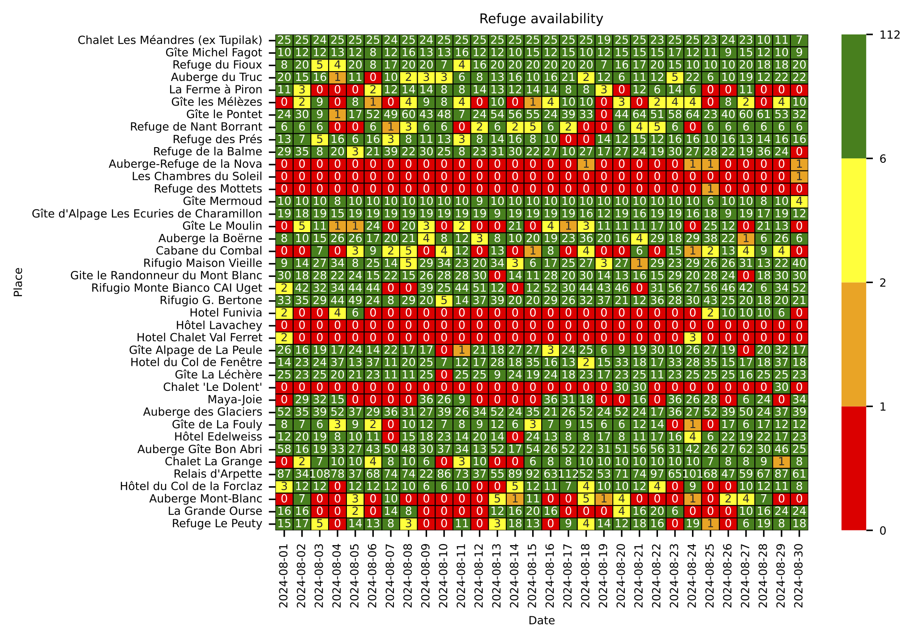

# Tour du Mont Blanc
`tmb` is a Python application to help you plan your Tour du Mont Blanc (TMB) hike.

I built this tool because I wanted to check the availability of refuges on a specific route starting on a specific date (say 1 July 2023).
Most refuges on the TMB list their availability on https://www.montourdumontblanc.com, but the website is a hard to navigate.
You would have to find each refuge, click the calendar up to some date and then figure out if everything is aligned.
Instead, this application will help you to make an availability calendar for each of the requested refuges, showing in one glance if the planned itinerary is possible or not.

## How to use
Make sure you have all dependencies installed (setup using `poetry install` or install dependencies manually).

Run the following script to get the availabilities of all huts from 1 August 2024 onwards.

``` python
from datetime import datetime
from pathlib import Path

import pandas as pd

import tmb

data_loc = Path("data/refuges.csv")
refuges_df = pd.read_csv(data_loc)

date = "2024-08-01"
availability = {}

for idx, data in refuges_df.iterrows():
    refuge = data["name"]
    id = data["id"]
    availability[refuge] = tmb.get_availability(date, id=id)

df = pd.DataFrame(availability).T
df.columns = df.columns.date

today = datetime.now().strftime("%Y%m%d")
tmb.plot(df, f"{today}_availability.pdf")

```

This results in the following plot:


    
## Notes
- Not all refuges on the TMB have their availability listed on https://www.montourdumontblanc.com.
- If you follow the standard TMB stages, most of the popular refuges are already fully booked by November. You will need to plan an itinerary that doesn't follow the classic TMB stages. (See https://tourdumontblanchike.com/tour-du-mont-blanc-etapes-stages/ about the stages).
